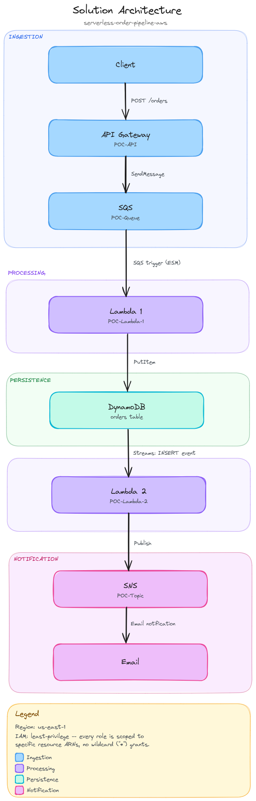
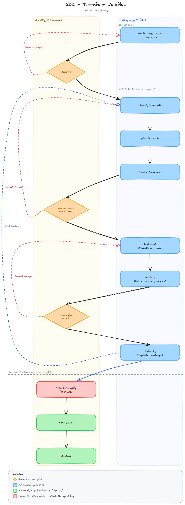

# serverless-order-pipeline-aws

Starting from a classic AWS Architecting Solutions exercise, this repo
explores what happens when you apply Spec-Driven Development and an AI
coding agent to infrastructure work: better IAM scoping, an auditable
decision trail, and architecture improvements the original exercise
never asked for.

## Architecture



```
Client --POST /orders--> API Gateway --SendMessage--> SQS (POC-Queue)
  --SQS trigger--> Lambda 1 --PutItem--> DynamoDB (orders)
  --Streams INSERT--> Lambda 2 --Publish--> SNS (POC-Topic) --> Email
```

- **API Gateway → SQS**: a native AWS Service integration (`POST /orders`)
  writes straight to SQS — no Lambda sits in the request path just to
  forward a message.
- **SQS → Lambda 1 → DynamoDB**: the queue decouples ingestion from
  processing and absorbs bursts; Lambda 1 persists each order with a
  generated `orderID`.
- **DynamoDB Streams → Lambda 2 → SNS → Email**: every insert into
  `orders` triggers Lambda 2 asynchronously via DynamoDB Streams, which
  publishes a notification to SNS's single email subscription — no
  polling anywhere in the pipeline.

Region: `us-east-1` (single region, no multi-environment — see
`specs/constitution.md` for the full scope decision).

## Key architecture decisions

The full decision log (with context, alternatives, and consequences) is
in each feature's `plan.md` under `specs/features/`. Headlines:

- **Least privilege everywhere, with one documented exception.** Every
  IAM policy is scoped to the exact ARN of the resource it needs — no
  `Resource: "*"`, except for the account-level API Gateway CloudWatch
  role, which AWS structurally requires to have broader CloudWatch Logs
  permissions
  ([`core-pipeline` ADR-2](specs/features/core-pipeline/plan.md),
  [`api-ingestion` ADR-10](specs/features/api-ingestion/plan.md)).
- **Decoupling with a safety net.** SQS sits between the API and the
  processing Lambda, and `POC-Queue` has a dead-letter queue so a
  poison-pill message gets set aside after 5 failed attempts instead of
  retrying forever — a deliberate improvement over the original exercise
  ([`core-pipeline` ADR-3](specs/features/core-pipeline/plan.md)).
  Batch failures are reported per-message
  (`ReportBatchItemFailures`), so one bad order never blocks the rest of
  a batch.
  DynamoDB Streams (`NEW_IMAGE`) does the same decoupling job on the
  notification side — Lambda 2 reacts to data changes, it isn't wired
  directly to Lambda 1.
- **No implicit resource creation.** Both Lambdas' CloudWatch Log Groups
  and API Gateway's access-log group are declared explicitly, with
  bounded retention and a `depends_on` that forces Terraform to create
  them before the resource that would otherwise create them implicitly
  ([`core-pipeline` ADR-4](specs/features/core-pipeline/plan.md)).
- **Errors are explicit, not silent.** `api-ingestion`'s `200` response
  maps SQS's raw XML to JSON; because that response is now explicitly
  mapped, `400`/`500` are mapped too — an unmapped SQS error would
  otherwise surface as a misleading `200`
  ([`api-ingestion` ADR-8](specs/features/api-ingestion/plan.md)).

## Repo structure

```
specs/               # Constitution, tech stack, roadmap, and per-feature specs/plans/tasks (SDD)
envs/dev/            # Terraform stack for the dev environment
modules/             # Reusable Terraform modules (only where justified — none needed yet)
src/lambdas/         # Python code for the Lambdas (lambda_1: SQS -> DynamoDB, lambda_2: Streams -> SNS)
docs/diagrams/       # Architecture and SDD workflow diagrams (Excalidraw sources + PNG exports)
docs/reference/      # Reference material (original exercise baseline)
.github/workflows/   # CI (fmt + validate, no credentials, no apply)
```

## How to deploy

Deployment is manual, by design — the coding agent never runs
`terraform apply` (see [Development workflow](#development-workflow)
below). To stand this up in your own AWS account:

```bash
cd envs/dev
terraform init

# notification_email has no default on purpose — supply your own
cp terraform.tfvars.example terraform.tfvars
# edit terraform.tfvars and set notification_email

terraform plan
terraform apply
```

After `apply`, AWS emails the address in `notification_email` a
subscription-confirmation link — the SNS subscription stays
`PendingConfirmation` until you click it. Test the pipeline with:

```bash
curl -X POST "$(terraform output -raw api_invoke_url)/orders" \
  -d '{"item": "widget", "quantity": 3}'
```

You should get a JSON response with a `messageId`, an item appear in the
`orders` DynamoDB table shortly after, and an email notification once the
subscription is confirmed.

### Tearing down

This is a portfolio PoC, not a running service — destroy it when you're
done to avoid incurring cost:

```bash
cd envs/dev
terraform destroy
```

## Development workflow

This repo is also a demonstration of **Spec-Driven Development (SDD)**
with an AI coding agent working under explicit human architectural
ownership: the agent drafts and implements, the architect designs,
reviews, and is the only one who ever runs `terraform apply`.



**Setup, once**: the agent drafts `specs/constitution.md` (mission, stack,
conventions) and `specs/roadmap.md` (planned features); the architect
reviews and approves before anything else happens.

**Per feature**, the cycle repeats:

1. **Specify** — the agent drafts `spec.md`: what, why, scope, verifiable
   acceptance criteria.
2. **Plan** — the agent drafts `plan.md`: technical approach, files
   touched, Architecture Decision Records (ADRs) for anything
   non-obvious — IAM scoping choices are always ADRs.
3. **Tasks** — the agent drafts `tasks.md`: atomic, one-commit-each tasks
   with a Definition of Done.
4. **Approval gate** — the architect reviews all three and either
   approves or requests changes. No infrastructure code gets written
   before this gate passes.
5. **Implement** — the agent writes the Terraform and Python, one commit
   per task.
6. **Validate** — `terraform fmt -check` → `terraform validate` →
   `terraform plan`, never `apply`.
7. **Review gate** — the architect reviews the plan output against the
   spec's acceptance criteria.
8. **Replanning** — the agent updates `specs/roadmap.md` to mark the
   feature done, then the cycle starts again for the next feature.

**Once every feature is code-complete** — outside the agent loop
entirely — the architect runs `terraform apply` manually, verifies the
live pipeline, and `terraform destroy`s it when done.

This project's own `specs/` directory is the artifact trail of that
process: every `spec.md`/`plan.md`/`tasks.md` under
[`specs/features/`](specs/features/) is a real, unedited record of how
each feature was actually designed and approved, not a retrofit.
[`specs/retrospective.md`](specs/retrospective.md) captures what worked
and what didn't about running SDD this way.

## License

[MIT](LICENSE)
